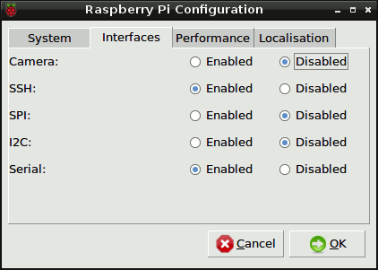
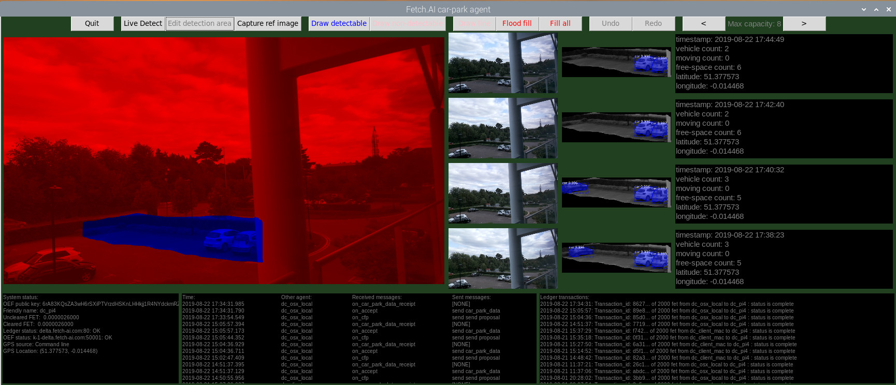
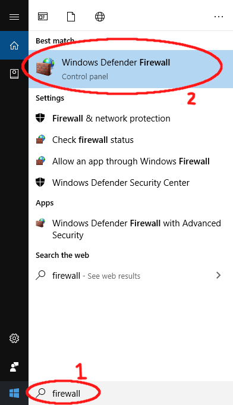
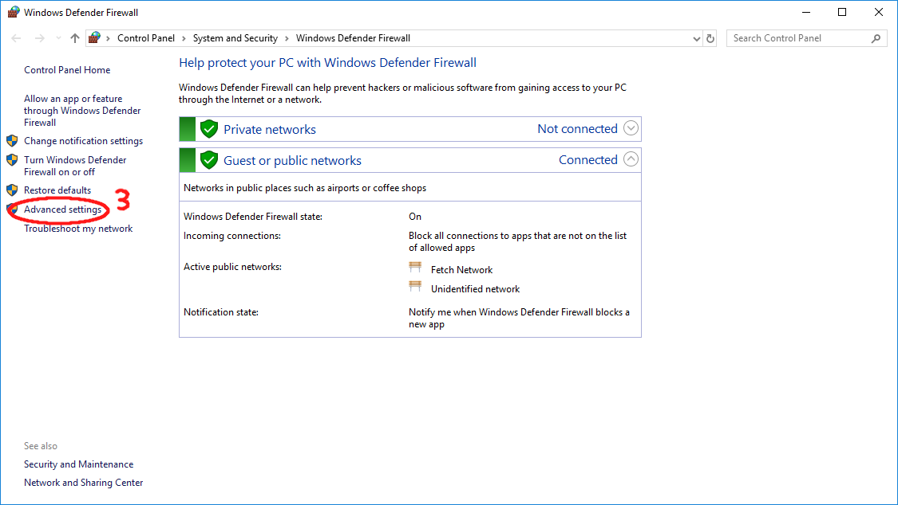
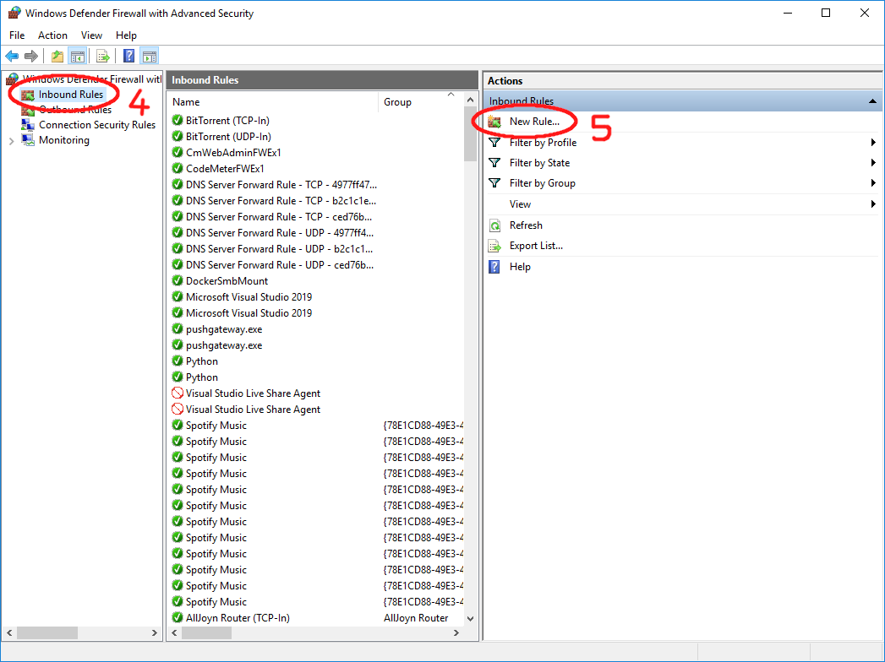
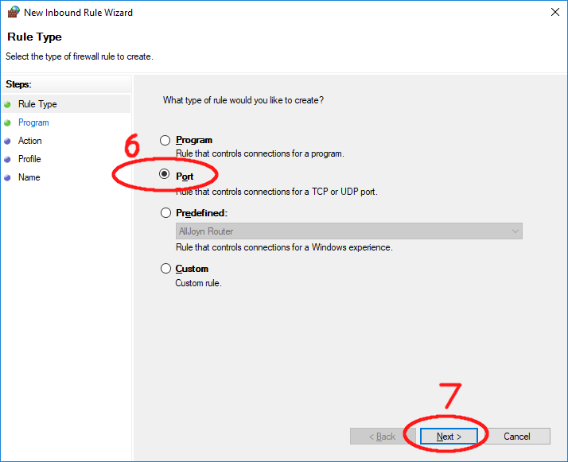
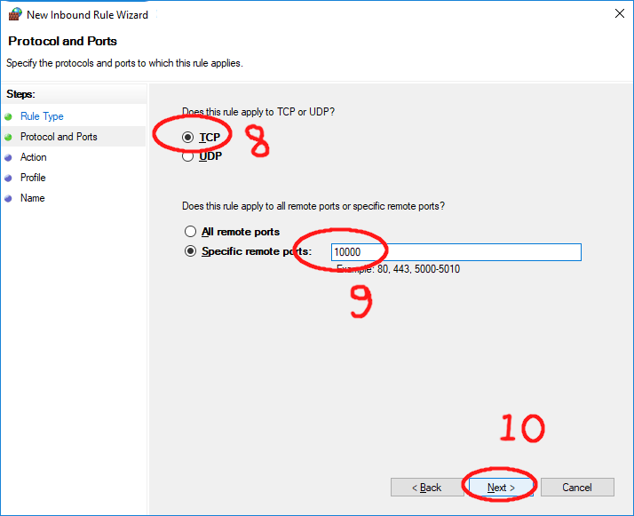
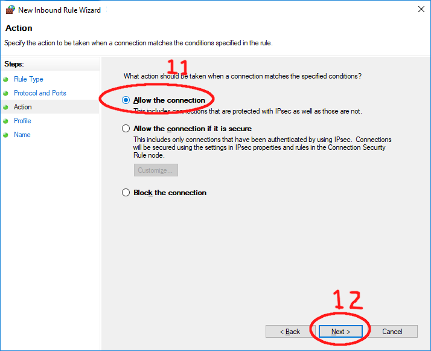
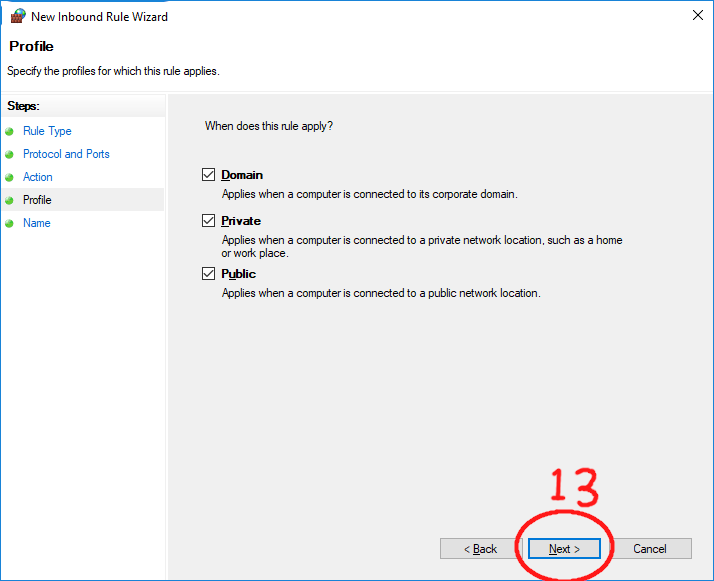
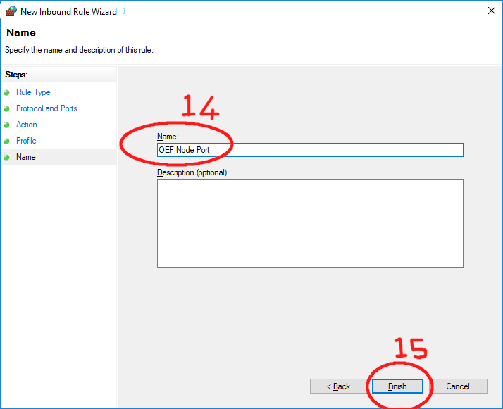

# Fetch.AI Car Park Agent

IMPORTANT: THIS PROJECT IS NOT YET "PUBLIC". IT IS OCCASIONALLY BEING MADE PUBLIC FOR TESTING PURPOSES.

This is a project to get a Fetch.AI agent running on a Rasperry Pi which utilises the camera to report on free parking spaces. This data is made available on the Fetch network and can be purchased by other agents. 

This project primarily targets the Raspberry Pi 4. It can be made to run on the Raspberry Pi 3, but it struggles a little.

This document will take you through:

* 1 . [Physically building the Camera/Raspberry PI module](#1-physically-building-the-car-park-agent)
* 2 . [Preparing the Raspberry Pi and OEF Node](#2-preparing-the-raspberry-pi=)
* 3a. [Running an OEF Node on Mac](#3a-running-an-oef-node-on-mac) (alternatively) 3b. [Running an OEF Node on Windows](#3b-running-an-oef-node-on-windows) 
* 4a. [Installing the carpark_agent on Rasperry Pi Version 4](#4a-installing-the-carpark_agent-on-rasperry-pi-version-4) (alternativley [4b Version 3 instructions](#3b-installing-the-carpark_agent-on-rasperry-pi-version-3))
* 5a. [Installing the client software on a Mac](#5a-installing-the-client-software-on-a-mac) (alternativley [5b Windows instructions](#5b-installing-the-client-software-on-windows))

The results will look like this:

| Hardware  | Car Park Agent GUI  | Client Agent GUI  |
| ------------- |:-------------:|:-----:|
|         |   |  |

## 1. Physically building the car park agent
### Prerequisits
Things you will need - I've added links to the specific things I bought:
* Raspberry Pi 4 [link](https://thepihut.com/products/raspberry-pi-4-model-b?gclid=EAIaIQobChMImcuwvcfh4wIVirHtCh3szg2EEAAYASAAEgJQ_fD_BwE)
* Raspberry PI Camera [link](https://thepihut.com/products/raspberry-pi-camera-module?variant=758603005)
* Case to put Raspbery Pi and Camera in [link](https://uk.rs-online.com/web/p/products/1270210/?grossPrice=Y&cm_mmc=UK-PLA-DS3A-_-google-_-CSS_UK_EN_CatchAll-_-Catch+All-_-PRODUCT_GROUP&matchtype=&pla-381930223918&gclsrc=aw.ds&&gclid=EAIaIQobChMIqoC2hsjh4wIVxbHtCh0w5whsEAQYASABEgKsJfD_BwE)
* Clamp and Arm [link](https://www.amazon.co.uk/dp/B011769YUM/ref=pe_3187911_189395841_TE_dp_1)
* An HDMI monitor and USB moue and keyboard to plug into your Raspberry Pi
* A PC or Mac 
* A network which the PC/Mac and Raspberry pi can connect to

I use a wireless network because, once your Raspberry Pi is set up, you want as few wires going to it as possible .

The Raspberry Pi case I got has excellent instructions on how to put it together and mount the Raspberry PI and Camera inside it. However, this case is desgined for the Raspberry Pi 3 rather than 4 and so the side with the holes for the HDMI output will not fit on when the board is inside. I just left this side off, but you could probably enlarge the holes with a file.
https://docs-emea.rs-online.com/webdocs/166a/0900766b8166a59a.pdf

Note that that if using a Raspberry Pi 4, the case in the link doesn't fit around the dual mini HDM sockets. I just left this side off and screwed it all together anyway. The other thing to be careful of is that as there is a choice about which mini-hdmi socket to connect your display to. I found that you need to connect it to HDMI-0. This is the one next to the power socket. If it is attached to the other one, it often remains blank when you try and boot up. 

I will attach the clamp and arm to the box later, 

Plug in the monitor, keyboard and mouse.

## 2. Preparing the Raspberry Pi
If you have got a brand-new Raspberry Pi, you can simply insert the SD card, connect the power and boot up. 

If you do not have a new Rasperry Pi SD card, you will need to make one. To do this follow the NOOBS insructions below. 

### NOOBS
NOOBS is a way to get an SD card like it was when you got your Raspberry Pi new from the shop. Go to here and follow the instructions (I used the "Offline and network install" option): 
https://www.raspberrypi.org/downloads/noobs/
 
Once you have set up your SD card, plug it into your Raspberry Pi, connect the power and watch it boot up. When prompted select the Raspbian operating system and click on Install. 

### Booting up and updating the OS
When you first boot your Raspberry Pi, you will be prompted to enter a password for the Raspberry PI and your wifi password so the Raspberry Pi has access to the internet. You may also be given the option to update the operating system and software. Let the system update and when it has finished you will be prompted to restart. Do this.

I recommend having these instructions easily accessible on your Raspberry Pi so you can copy and paste lines into the terminal. You will also be restaring your Raspberry Pi a few times during this process. When your Raspberry Pi has restarted, open up the Browser and enter this into the address bar:

    https://github.com/fetchai/carpark_agent

This takes you to the web-page with these instructions. Now click the star on the right of the address bar to add it as a bookmark. Then click on the three vertical dots at the top right of the browser (settings) and click on Bookmarks and then on "Show Bookmark Bar". This will put a link to this page at the top of your browser window every time you open it. 

Even if your Raspberry Pi updated itself, I recommend making sure it is completely up to date using the terminal. Open a Terminal window and type:

    sudo apt update -y
    sudo apt-get update
    sudo apt-get dist-upgrade
    
Occasionally I have found that this last step gives errors halfway through the installation, I get an error message saying something like "unable to install....". 
If you get error messages, then I you can usually fix it by simply retyping that last line again:
 
    sudo apt-get dist-upgrade
    
If the upgrade step fails, then the rest of these instrutions will not work. Once everything is installed you need to reboot. You can do this from the terminal.

    sudo reboot

### Configuring the Raspberry Pi and OEF Node
Click on the Raspberry symbol in the top left of the screen. Select Preferences -> Raspberry Pi Configuration.

 

Select the Interfaces tab. Enable the following:
* Camera
* SSH
* VNC

 

VNC is a service that lets us control the Raspberry Pi's desktop even when the monitor, keyboard and mouse have been disconnected.

Close the window. You will be asked to reboot - do so. When it has rebooted you need to find out the ip address of your raspberry pi. Open a Terminal and type:

    ifconfig

There should be a some lines saying something like:

    ...
    wlan0: flags=4163<UP,BROADCAST,RUNNING,MULTICAST>  mtu 1500
        inet 192.168.11.9  netmask 255.255.255.0  broadcast 192.168.11.255
    ... 

The numbers after inet is my Raspberry Pi's ip address. In this case 192.168.11.9. Write these down.

It is important to set the screen resolution of the Raspberry Pi, otherwise it can have problems when the display is disconnected. Open a terminal and type:
 
    sudo raspi-config
    
Use the up/down arrow keys
* Select Advanced options and press Enter
* Go down the Resolution and press Enter
* Go to the 1920X1080 option and press Enter
* Confirm the change
* Use the right arrow to select <Finish>, press Enter
* You may be prompted to restart - do so
 
### Testing VNC on PC/Mac
Now we need to turn our attention to our Mac or PC. On your MAc/PC, downloading and installing VNC viewer:
https://www.realvnc.com/en/connect/download/viewer/

When you run it, you there should be a bar at the top where you can type in an IP address. Type in the IP address of your Raspberry Pi. You will be prompted for your Raspberry Pi password. You should then see your Raspberry Pi's desktop in a window on your Mac or PC.

Now we need to test it without the monitor plugged in- you can do this via the remote desktop screen:
* Shut down your Raspberry Pi using the Raspberry icon at the top left of the screen
* Unplug your monitor
* Unplug the power from the mains, leave it for 10 seconds then plug it back in to reboot
* Use your VNC Viewer to view the desktop of the Raspberry Pi

The reason for testing that this works is that while I never had any problems doing this on the Raspberry Pi 3, the Raspberry Pi 4 had an issue where the screen would revert to a very low resolution and 4:3 aspect ratio when using VNC after rebooting without the monitor plugged in. The car park agent is very difficult to use if this happens, and so I recommend fixing this issue (see next).

### Fixing the low screen-resolution issue on Raspberry Pi 4
Using the VNC Viewer. Open a terminal on the Raspberry Pi and type:

    sudo nano /boot/config.txt
 
 Use the Nano editor to scroll down until you see the following lines:
 
    [pi4]
    # Enable DRM VC4 V3D driver on top of the dispmanx display stack
    dtoverlay=vc4-fkms-v3d
    max_framebuffers=2
 
 Comment out the latter two lines so it now says:
 
    [pi4]
    # Enable DRM VC4 V3D driver on top of the dispmanx display stack
    # dtoverlay=vc4-fkms-v3d
    # max_framebuffers=2

Note: I had some difficulty getting my keyboard to type a # symbol on the Raspberry Pi. I ended up copying the symbol into the clipboard from these instructions and then using the menu at the top of nano to paste it into the file. 

Save this file and exit the editor. Now reboot. You can do this by typing into the terminal:
 
    sudo reboot
    
As you reboot, your VNC Viewer on your Mac or PC will no longer be able to see your screen. However it will come back to life once your Raspberry Pi has booted up.

Now when the RPi restarts, the VNC Viewer should show a nice large resolution. If this is what happens, you can shut it down, reconnect your monitor and restart it.

Now we need to get an OEF node running on the Mac/PC. To do this we need slightly different instructions for each platform. So select the appropriate instructions for the next step. 

## 3a. Running an OEF Node on Mac
These instructions are to get on OEF Node running on a cleanly installed Mac OS. However, in the process, we will also be prearing the Mac for running the carpark client agent later on.
 
### Preparing the Mac
If you do not have Homebrew already installed, open a terminal:

    xcode-select --install
    
Go through the various dialog boxes agreeing to everything and wait till all the X-code tools install. Now go back to the terminal:

    ruby -e "$(curl -fsSL https://raw.githubusercontent.com/Homebrew/install/master/install)"
    
You need to press ENTER to confirm and will be prompted to give your password.

Now we need to install some software to support the agent. Paste these lines into a Terminal window:
    
    brew install wget python3 opencv3
    pip3 install virtualenv

### Get the carpark agent code     
We will get the agent code into a folder on the Desktop. In the terminal type:

    cd ~/Desktop
    git clone https://github.com/fetchai/carpark_agent.git
    cd carpark_agent

### Running the OEF Node    
The Car Park agent needs to connect to an Open Economic Framework (OEF) Node. This will enable it to registers its services for other agents to find. At present this node will need to be run locally on your desktop machine. This "local" setup will only let your agents interact with other agents connected locally to this node. In future, Fetch.ai will deploy a decentralised network that agents can use to find each other anywhere in the world.

To run an OEF node you will need to have docker installed. If you don't have it, please check the official documentation [here](https://docs.docker.com/install/), scroll down to the section entitled "Supported platforms" and follow the instructions for your platform.

Wen you have docker installed, you can run this script to run the oef node:

    python aea_scripts/oef/launch.py --name oef_node -c ./aea_scripts/oef/launch_config.json
    
In the terminal you should see a load of output finishing with the phrase "A thing of beauty is a joy forever...". If you see this, the Node is running correctly.

### Getting IP address        
Later on we will need to use the IP address of your Mac/PC so you need to write this down. There are instructions [here](https://www.tp-link.com/us/support/faq/838/) on how to find your IP address on different platforms. When you have your Mac/PC machine's IP address, write it down. 

## 3b. Running an OEF Node on Windows
Its a bit more awkward getting this stuff running in Windows as many of the tools and scripts we use are Linux based. However, it can be done. 

### Instaling Git-Bash
You will need to clone the repository from github as well as execute various linux type Bash scripts. In order to do this, I recommend following these instructions to get Git-Bash installed. Follow these instructions up to and including Step 3 of "Configuring and connecting to a remote repository" - this step starts with the words "After entering the above command..."'  
https://www.computerhope.com/issues/ch001927.htm

You can now used Git-Bash to execute any of the Linux style bash scripts. 

### Installing Python
Download and run this installer:

https://www.python.org/ftp/python/3.7.4/python-3.7.4.exe

On the first page of the installation program there is check box "Add Python 3.7 to PATH" tick this. 

Open Git-Bash and you will be presented with a Linux style terminal window. Type:

    $ python --version
    
This should print something like:
    
    Python 3.7.3
    
However, if it shows an earlier version e.g.:
    
    Python 2.7.15

Then if means you still have Python 2 in your system PATH and it needs to be removed. To do this on Windows 10:
*   Go to the search bar in the bottom left of the screen and type Environment
*   Click on "Edit the System Environment Variables" option
*   Click on the "Environment variables..." button
*   In the bottom section entitled "System Variables" double click on the Path entry
*   Find the entry with the location of the earlier version of Python e.g. "C:\Python27" select it and press the delete button
*   There may be more than one such entry delete all of them (though keep any which refer to Python37 as this is the new one we just installed)
*   When finished click OK

You will need to close down Git-Bash and restart it.

Now you can open Git-Bash and type:

    $ python --version

Check that is displays the correct version.

Now install virtualenv. Type:
    
    pip install virtualenv
    
### Getting the crpark agent code
Using the Git-Bash terminal you can now get the car_park agent code from git-hub. In the Git-Bash terminal type:

    cd ~/Desktop
    git clone https://github.com/fetchai/carpark_agent.git
    cd carpark_agent

### Running an OEF Node
The Car Park agent needs to connect to an Open Economic Framework (OEF) Node. This will enable it to registers its services for other agents to find. At present this node will need to be run locally on your desktop machine. This "local" setup will only let your agents interact with other agents connected locally to this node. In future, Fetch.ai will deploy a decentralised network that agents can use to find each other anywhere in the world.

To run an OEF node you will need to have docker installed. If you don't have it, please check the official documentation [here](https://docs.docker.com/install/), scroll down to the section entitled "Supported platforms" and follow the instructions for your platform.

When you have docker installed, you will need to open a command prompt (for some reason, this doesn't always work from the Git-Bash terminal). 

To do this: Click on the Search field in your task bar and type "CMD". Click on the Command Prompt result and then you have a terminal window you can type in.

Go to the carpark agent directory:

    cd Desktop/carpark_agent

Now you can run this script to run the oef node:

    python aea_scripts/oef/launch.py --name oef_node -c ./aea_scripts/oef/launch_config.json

In the terminal you should see a load of output finishing with the phrase "A thing of beauty is a joy forever...". If you see this, the Node is running correctly. 

### Getting IP address        
Later on we will need to use the IP address of your Mac/PC so you need to write this down. There are instructions [here](https://www.tp-link.com/us/support/faq/838/) on how to find your IP address on different platforms. When you have your Mac/PC machine's IP address, write it down.

## 4a. Installing the carpark_agent on Raspberry Pi Version 4
I would now work directly on the Raspbery Pi instead of via the VNC connection as VNC can be quite laggy.

We will be getting the code from github.com. 

### Getting the code
Open a terminal and type:

    cd ~/Desktop
    git clone https://github.com/fetchai/carpark_agent.git
    cd carpark_agent
    
In order to run the machine learning algorithms we need to download a large datafile. In the terminal, type:

    ./car_detection/weights/download_weights.sh
    
There are a number of things that need to be installed on the Raspberry Pi before we can install the agent code itself. Paste this line into the terminal (careful its a long one tha goes off the page, so make sure you select it all before doing copy/paste)

    sudo apt-get install gcc htop vim mc python3-dev ffmpeg virtualenv libatlas-base-dev libsm6 libxext6 clang libblas3 liblapack3 liblapack-dev libblas-dev cython gfortran build-essential libgdal-dev libopenblas-dev liblapack3 liblapacke liblapacke-dev liblcms2-utils liblcms2-2 libwebpdemux2 python3-scipy python3-numpy python3-matplotlib libjasper-dev libqtgui4 libqt4-test protobuf-compiler python3-opencv gpsd gpsd-clients subversion

Now type this:

    pip3 install virtualenv     

Create the virtual environment and activate it

    ./run_scripts/create_venv.sh
    source venv/bin/activate
    
Install the software:
    
    python setup.py 
      

### Building the Autonomous Economic Agent (AEA)

First we need to download the packages and scripts:

    svn export https://github.com/fetchai/agents-aea.git/trunk/packages

To build the agent which connects to the Fetch.AI network we will use the AEA framework. This will have been installed during the setup process above. Type:

    aea create carpark_aea
    cd carpark_aea
    aea add skill carpark_detection
    aea install   
    
Now we need to give the agent information about the Fetch.ai ledger that it uses to process transactions. To this you need to edit the aea-config.yaml file:

    nano aea-config.yaml
    
Fine the line that says

    ledger_apis: []

and replace it with:

    ledger_apis:
    - ledger_api:
        addr: alpha.fetch-ai.com
        ledger: fetchai
        port: 80

Save and exit nano.

### Ensure it runs correctly (RPi4 only)
Try running it
    
    aea run
    
You should now see the agent running.

If you go back to your Mac or PC and go to the github repository for this project and look under resources/images there is an image of a car-park. Print this out and tape it to a wall and point the raspberry pi camera at it. Every few minutes, it will capture in email and perform vehicle detection on the image (detections showing up in blue or green) It should detect the cars in your picture (you might have to wait a few minutes to know that it has worked)

If this all seems to work, power down your Raspberry pi, disconnect the power, keyboard, mouse and keyboard.

Attach the Clamp and Arm and set the camera up pointing to your parking spaces, reconnect the power and let it boot up.

 
### Configuring the car-park agent (RPi4 only)
Now go back to your Mac or PC and start up VNC viewer and connect to the Raspberry Pi. 

The agent will not be running. So, open a terminal and type:

    cd Desktop/carpark_agent/carpark_aea
    aea run

When it starts up and you see the output from the camera, you can move your camera around so it is looking at the area you are interested in.

 

There are likely to be cars in many parts of your image and by default your agent is set up to detect cars everywhere. To restrict detections to the area you are interested in:
* Press Edit Detection Area button
* Press Capture Ref Image button - this will capture in image from the camera and it should be tinted blue - indicating that it will detect everywhere
* Press the red Fill All button - This will turn it all red - showing it will now detect nowhere
* Press Draw detectable button and then draw an outline around the area you are interested in. Ensure you make a completely closed shape
* Press the blue Flood Fill button and then click inside the shape you have drawn. This should fill it blue
 

Note that this UI can be a bit laggy when running over VNC and while detections are going on, so just do it slowly and be patient.

Count the number of parking spaces in the area of interest you marked out. If it is hard to see, press Live Detect to see things more clearly. When you have counted them press Edit Detection area again to go into edit mode.
Use the arrows either side of "Max Capacity" to set the correct number of parking spaces that the agent can report on.

When you are done press the Live Detect button. 

Close down the agent by pressing the Quit button. If you watch the terminal window that you launched it from, you may find that it takes a while to fully shut down - this is because if it is in the middle of a detection it needs to finish what it is doing before quitting. This can take a minute or so.  

We now need to edit config files of the agent.  In the terminal window make sure your current directory is ~/Desktop/carpark_agent/carpark_aea and type:
    
    cd skills/carpark_detection 
    nano skill.yaml

You need to set the latitude and longitude of your location. An easy way to find out what this is, is to go open a browser and go to Google Maps and find your current location. Then right click at your location and select "What's here?". A small window will pop up which will let you copy the latitude and longitude of that location. 

Paste these values into the config file. E.g.:

        default_longitude: 0.154021
        default_latitude: 52.235063

Note that the data_price_fet argument is how much tenths of a nano-FET we wish to charge other agents for information about parking. Note that a tenth of a nano-FET is 0.0000000001 FET, so the default value here is 0.02 FET. In the UI this will be displayed in milli-FET. i.e. 20 milli-FET

Save and close the skill.yaml file.

We also need to tell our agent where the search and descovery server is. For the moment you need to point this to your local desktop machine (we wrote this down earlier in the section "Get your desktop IP Address"). In my case, my desktop IP address is "192.168.95.127". 

Navigate to the oef connection directory:

    cd ../../connections/oef
    nano connection.yaml
    

Replace the specifying the OEF Node IP address with your desktop IP address. This is what mine would say:

    addr: ${OEF_ADDR:192.168.95.127}
    
Save and close this file.

Save the edited file and close the editor.

### Make the agent start on boot up (RPi4 only)

The final thing we need to do is to make the script run whenever we start the Raspberry Pi up. In a terminal type:
    
    crontab -e
    
You may be asked to specify which editor you wish to use.

This editor will then open a text file - scroll down to the bottom and add the following line right the bottom:

    @reboot cd /home/pi/Desktop/carpark_agent/carpark_aea && source ../venv/bin/activate && aea run
  
Save the file exit the editor. Reboot your Raspberry Pi.

The carpark agent should now start up after it has booted. Wait for a detection to happen. Look at the stats in the panel on the right hand side of the images. You should see the total number of parking spaces, the number of vehicles detected, the number of free spaces and the latitude and longitude. Check this is all correct. If you click your mouse on any of the smaller images on the right, they will be enlarged in the main panel.

In the bottom left there is a status panel. The status of the OEF will show an error as we have not yet set up an OEF Node on your desktop machine for the agent to connect to.

## 4b. Installing the carpark_agent on Rasperry Pi Version 3
In this section I'll describe how to get the car-park agent running on a Raspberry Pi version 3. Version 3 is very similar to 4 in the way it works but it can only have a maximum of 1GB of RAM (as opposed to Version 4 whihc can have 4 GB of RAM). 1GB is not enough to run the car detection algorithms and so the way we get around this is to allocate a large "swap file" for the Raspberry Pi OS. This is an area of the SD car allocated to the OS which it can treat just like RAM. The SD card is many times slower than NAtive RAM and as a result the algorthm runs MUCH slower on the Version 3 and than on the 4 (taking roughly 5 minutes per detection run). The other issue is that sometimes the scripts simply run out of usable memory and crash. I haven't been ale to completely understand why, but I think it relates to the available address space and memory fragmentation. Anyway, the fix for this is to not run the car-park agent all in one process. Instead I split into two proccess:
*  Process 1 runs the GUI, the camera, the image capture and the Fetch.AI agent selling the data
*  Process 2 runs the car detection algorithm only

At the moment (due to a recent change in the setup - this splitting of processes is not working. At present it ill just run it all on one process)
 
To build the car-park agent on a Raspberry Pi version 3 (instead of version 4), follow all the steps described above for version 4. However, before running the agent, you will need to do the following: 

### Create a larger SWAP file
In the terminal, type:

    sudo nano /etc/dphys-swapfile
    
Scroll down to the line that says:
    
    CONF_SWAPSIZE=100
    
Change it to:

    CONF_SWAPSIZE=2048
  
Save the file and exit nano. Reboot the Raspberry Pi.

## 5a. Installing the client software on a Mac
    
            
### Installing the code
Now this is running we will need to open another terminal window. Go to your carpark agent directory

    cd ~/Desktop/carpark_agent
        
Create and activate the virtual environment and install the python packages
    
    ./run_scripts/create_venv.sh
    source venv/bin/activate
    python setup.py
    
### Building the Autonomous Economic Agent (AEA)

First we need to download the packages and scripts:

    svn export https://github.com/fetchai/agents-aea.git/trunk/packages

To build the agent which connects to the Fetch.AI network we will use the AEA framework. This will have been installed during the setup process above. Type:

    aea create carpark_client_aea
    cd carpark_client_aea
    aea add skill carpark_client
    aea install    
    
Now we need to give the agent information about the Fetch.ai ledger that it uses to process transactions. To this you need to edit the aea-config.yaml file:

    nano aea-config.yaml
    
Fine the line that says

    ledger_apis: []

and replace it with:

    ledger_apis:
    - ledger_api:
        addr: alpha.fetch-ai.com
        ledger: fetchai
        port: 80    
    
Now you can run the agent
    
    aea run
    
This will loop through the following actions:
1. Search for agents offering carpark detection services
2. If an agent is found, send it a CFP (Call For Proposal)
3. If the proposal it receives is cheap enough and the data new enough it purchases it

The output messages from this process are displayed in the terminal output. 

## 5b. Installing the client software on Windows
The client agent (which can request data) can also be run on Windows. However, you cannot at present run the car park agent (which detects cars in a camera image) on Windows. This is due to some difficulties I have had getting the TensorFlow libraries running. These instructions have been tested on Windows 10.

 
    
### Installing the code
Now this is running we will go bak to our Git-Bash terminal. Create and activate the virtual environment (note that the script name to create the virtual environment is a bespoke windows version)
    
    ./run_scripts/create_venv_win.sh
    source venv/bin/activate
    
Now you need to install OpenCV, you will need a specific version of the python installation file. You can get from github:

    git clone git@github.com:fetchai/carpark_agent_big_data.git

Note that I originally got this from here: [https://www.lfd.uci.edu/~gohlke/pythonlibs/#opencv](https://www.lfd.uci.edu/~gohlke/pythonlibs/#opencv) But it seems to no longer exist. 

Now you need to install this file:

    pip install carpark_agent_big_data/opencv_python-4.1.1-cp37-cp37m-win32.whl
    
Now you can install the main application and its dependencies:
    
    python setup.py

### Building the Autonomous Economic Agent (AEA)

First we need to download the packages and scripts:

    svn export https://github.com/fetchai/agents-aea.git/trunk/packages

To build the agent which connects to the Fetch.AI network we will use the AEA framework. This will have been installed during the setup process above. Type:

    aea create carpark_client_aea
    cd carpark_client_aea
    aea add skill carpark_client
    aea install    
    
Now we need to give the agent information about the Fetch.ai ledger that it uses to process transactions. To this you need to edit the aea-config.yaml file:

    nano aea-config.yaml
    
Fine the line that says

    ledger_apis: []

and replace it with:

    ledger_apis:
    - ledger_api:
        addr: alpha.fetch-ai.com
        ledger: fetchai
        port: 80    

### Opening up the ports on Windows Firewall
If you have yours Windows firewall enabled (which it is, by default), it will block the Raspberry Pi's trying to contact it. To avoid this problem, you need to open this port so they can connect.

1. Go to the search bar and type "firewall"
2. Click on "Windows Defender Firewall"

 
3. Click on Advanced settings

4. Click on "Inbound Rules"
5. Click on "New Rule"

6. Select "Port"
7. Click on "Next"

8. Select TCP
9. Select "Specific remote ports" and type 10000 (that's ten thousand) into the text box
10. Click on "Next"
 

11. Select "Allow the connection"
12. Click on "Next"

13. Ensure the rule applies in all cases and click on "Next"

14. Give the firewall rule a name, say "OEF Node Port"
15. Click on "Next"

Once this rule is applied, your Rasperry Pi should be connected to the OEF Node running on your windows machine and the OEF Status in the panel at the bottom of the UI on the Raspberry Pi agent should read "OK: connected"

### Getting the client running
Now you can run the agent. Make sure you are in the carpark_client_aea directory and type:
    
    aea run
    
This will loop through the following actions:
1. Search for agents offering carpark detection services
2. If an agent is found, send it a CFP (Call For Proposal)
3. If the proposal it receives is cheap enough and the data new enough it purchases it

The output messages from this process are displayed in the terminal output. 

## Trouble shooting
### Car detection not accurately detecting
We use an off-the-shelf car detection algorithm which is not trained specifically on car-parks. As with all computer vision it will not be 100% reliable however often detection rates can be made much better by choosing a more suitable vantage point for your camera.

